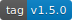
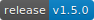
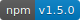
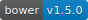
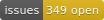
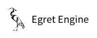

<!DOCTYPE html>
<!-- saved from url=(0042)https://pandao.github.io/editor.md/en.html -->
<html lang="en" class=" js flexbox flexboxlegacy canvas canvastext webgl no-touch geolocation postmessage websqldatabase indexeddb hashchange history draganddrop websockets rgba hsla multiplebgs backgroundsize borderimage borderradius boxshadow textshadow opacity cssanimations csscolumns cssgradients cssreflections csstransforms csstransforms3d csstransitions fontface generatedcontent video audio localstorage sessionstorage webworkers applicationcache svg inlinesvg smil svgclippaths" style=""><head><meta http-equiv="Content-Type" content="text/html; charset=UTF-8">
        
		<meta http-equiv="X-UA-Compatible" content="IE=edge">
        <meta http-equiv="Cache-Control" content="no-siteapp">
		<meta name="renderer" content="webkit">
		<meta name="viewport" content="width=device-width, initial-scale=1, maximum-scale=1, user-scalable=no">
        <meta name="keywords" content="Editor.md,editor,Markdown Editor,Markdown,编辑器,Markdown编辑器,Markdown在线编辑器,在线编辑器,开源编辑器,开源Markdown编辑器">
        <meta name="description" content="Editor.md: a simple online markdown editor. 开源在线 Markdown 编辑器">
	    <meta name="author" content="pandao, pandao@vip.qq.com">
        <title>Editor.md - Open source online Markdown editor.</title>
        <link rel="shortcut icon" href="https://pandao.github.io/editor.md/favicon.ico" type="image/x-icon">
        <link rel="stylesheet" type="text/css" href="./README_files/planeui.min.css">
        <link rel="stylesheet" href="./README_files/editormd.min.css">
        <link rel="stylesheet" type="text/css" href="./README_files/index.css">
    <link type="text/css" rel="stylesheet" href="./README_files/codemirror.min.css"><link type="text/css" rel="stylesheet" href="./README_files/dialog.css"><link type="text/css" rel="stylesheet" href="./README_files/matchesonscrollbar.css"><link type="text/css" rel="stylesheet" href="./README_files/foldgutter.css"><link type="text/css" rel="stylesheet" href="./README_files/katex.min.css"></head>
    <body cz-shortcut-listen="true" style="">
        
        
        

            <header class="pui-bg-blue page-header">
                

                    <h1 class="pui-text-center pui-text-xxxxxl page-title animated zoomInDown">
                        <a href="https://pandao.github.io/editor.md/index.html" class="pui-text-white">
                            <i class="editormd-logo editormd-logo-2x"></i><strong>Editor.md</strong>
                        </a>
                    </h1>
                    
Open source online Markdown editor.

                    <menu class="pui-text-center page-menu animated zoomInDown">
                        <ul class="pui-menu pui-menu-inline pui-menu-radius">
                            <li>
                                <a href="https://pandao.github.io/editor.md/en.html#download"><i class="fa fa-cloud-download"></i> Download</a>
                            </li>
                            <li>
                                <a href="http://editor.md.ipandao.com/examples/index.html"><i class="fa fa-flask"></i> Examples <i class="pui-arrow-down"></i></a>
                                <ul class="pui-menu pui-menu-dropdown pui-z-depth-2">
                                    <li>
                                        <a href="http://editor.md.ipandao.com/examples/simple.html">Simple example</a>
                                    </li>
                                    <li>
                                        <a href="http://editor.md.ipandao.com/examples/full.html">Full example</a>
                                    </li>
                                    <li>
                                        <a href="http://editor.md.ipandao.com/examples/html-preview-markdown-to-html.html">Markdown To HTML</a>
                                    </li>
                                    <li>
                                        <a href="http://editor.md.ipandao.com/examples/form-get-value.html">Get value on Form</a>
                                    </li>
                                    <li class="has-submenu">
                                        <a href="javascript:;">Markdown Extras</a>
                                        <ul class="pui-menu pui-menu-dropdown pui-z-depth-2">
                                            <li>
                                                <a href="http://editor.md.ipandao.com/examples/toc.html">ToC (Table of Contents)</a>
                                            </li>
                                            <li>
                                                <a href="http://editor.md.ipandao.com/examples/task-lists.html">GFM task lists</a>
                                            </li>
                                            <li>
                                                <a href="http://editor.md.ipandao.com/examples/emoji.html">Emoji</a>
                                            </li>
                                            <li>
                                                <a href="http://editor.md.ipandao.com/examples/@links.html">@Links</a>
                                            </li>
                                            <li>
                                                <a href="http://editor.md.ipandao.com/examples/katex.html">TeX (KaTeX)</a>
                                            </li>
                                            <li>
                                                <a href="http://editor.md.ipandao.com/examples/flowchart.html">FlowChart</a>
                                            </li>
                                            <li>
                                                <a href="http://editor.md.ipandao.com/examples/sequence-diagram.html">Sequence diagram</a>
                                            </li>
                                            <li>
                                                <a href="http://editor.md.ipandao.com/examples/html-tags-decode.html">HTML tags decode</a>
                                            </li>
                                        </ul>
                                    </li>
                                    <li class="has-submenu">
                                        <a href="javascript:;">Custom Editor.md</a>
                                        <ul class="pui-menu pui-menu-dropdown pui-z-depth-2">
                                            <li>
                                                <a href="http://editor.md.ipandao.com/examples/define-plugin.html">Define plugin</a>
                                            </li>
                                            <li>
                                                <a href="http://editor.md.ipandao.com/examples/themes.html">Custom editor theme</a>
                                            </li>
                                            <li>
                                                <a href="http://editor.md.ipandao.com/examples/custom-toolbar.html">Custom toolbar</a>
                                            </li>
                                            <li>
                                                <a href="http://editor.md.ipandao.com/examples/custom-keyboard-shortcuts.html">Custom keyboard shortcuts</a>
                                            </li>
                                            <li>
                                                <a href="http://editor.md.ipandao.com/examples/change-mode.html">Change mode</a>
                                            </li>
                                            <li>
                                                <a href="http://editor.md.ipandao.com/examples/manually-load-modules.html">Manually load modules</a>
                                            </li>
                                            <li>
                                                <a href="http://editor.md.ipandao.com/examples/multi-editormd.html">Multi Editor.md</a>
                                            </li>
                                            <li>
                                                <a href="http://editor.md.ipandao.com/examples/readonly.html">Read only mode</a>
                                            </li>
                                            <li>
                                                <a href="http://editor.md.ipandao.com/examples/code-fold.html">Code fold</a>
                                            </li>
                                            <li>
                                                <a href="http://editor.md.ipandao.com/examples/sync-scrolling.html">Bisync / Single sync scrolling</a>
                                            </li>
                                            <li>
                                                <a href="http://editor.md.ipandao.com/examples/external-use.html">External using method</a>
                                            </li>
                                            <li>
                                                <a href="http://editor.md.ipandao.com/examples/multi-languages.html">Multi-languages</a>
                                            </li>
                                            <li>
                                                <a href="http://editor.md.ipandao.com/examples/auto-height.html">Auto height</a>
                                            </li>
                                            <li>
                                                <a href="http://editor.md.ipandao.com/examples/dynamic-create-editormd.html">Dynamic create Editor.md</a>
                                            </li>
                                            <li>
                                                <a href="http://editor.md.ipandao.com/examples/search-replace.html">Search / Replace</a>
                                            </li>
                                            <li>
                                                <a href="http://editor.md.ipandao.com/examples/set-get-replace-selection.html">Insert value, Set/Get/Replace selection text</a>
                                            </li>
                                        </ul>
                                    </li>
                                    <li class="has-submenu">
                                        <a href="javascript:;">Event handle</a>
                                        <ul class="pui-menu pui-menu-dropdown pui-z-depth-2">
                                            <li>
                                                <a href="http://editor.md.ipandao.com/examples/on-off.html">On / Off (bind/unbind)</a>
                                            </li>
                                            <li>
                                                <a href="http://editor.md.ipandao.com/examples/onload.html">Onload</a>
                                            </li>
                                            <li>
                                                <a href="http://editor.md.ipandao.com/examples/onchange.html">Onchange</a>
                                            </li>
                                            <li>
                                                <a href="http://editor.md.ipandao.com/examples/onresize.html">Onresize</a>
                                            </li>
                                            <li>
                                                <a href="http://editor.md.ipandao.com/examples/onfullscreen.html">Onfullscreen / OnfullscreenExit</a>
                                            </li>
                                            <li>
                                                <a href="http://editor.md.ipandao.com/examples/onpreviewing-onpreviewed.html">Onpreviewing / Onpreviewed</a>
                                            </li>
                                            <li>
                                                <a href="http://editor.md.ipandao.com/examples/onwatch-onunwatch.html">Onwatch / Onunwatch</a>
                                            </li>
                                            <li>
                                                <a href="http://editor.md.ipandao.com/examples/onscroll-onpreviewscroll.html">Onscroll / Onpreviewscroll</a>
                                            </li>
                                        </ul>
                                    </li>
                                    <li class="has-submenu">
                                        <a href="javascript:;">Image upload</a>
                                        <ul class="pui-menu pui-menu-dropdown pui-z-depth-2">
                                            <li>
                                                <a href="http://editor.md.ipandao.com/examples/image-upload.html">Same domain upload</a>
                                            </li>
                                            <li>
                                                <a href="http://editor.md.ipandao.com/examples/image-cross-domain-upload.html">Cross-domain upload</a>
                                            </li>
                                        </ul>
                                    </li>
                                    <li class="has-submenu">
                                        <a href="javascript:;">Using Require.js, Sea.js, Zepto.js</a>
                                        <ul class="pui-menu pui-menu-dropdown pui-z-depth-2">
                                            <li>
                                                <a href="http://editor.md.ipandao.com/examples/use-requirejs.html">Using Require.js</a>
                                            </li>
                                            <li>
                                                <a href="http://editor.md.ipandao.com/examples/use-seajs.html">Using Sea.js</a>
                                            </li>
                                            <li>
                                                <a href="http://editor.md.ipandao.com/examples/use-zepto.html">Using Zepto.js</a>
                                            </li>
                                        </ul>
                                    </li>
                                    <li>
                                        <a href="http://editor.md.ipandao.com/examples/index.html">More...</a>
                                    </li>
                                </ul>
                            </li>
                            <li>
                                <a href="https://pandao.github.io/editor.md/en.html#dependents"><i class="fa fa-gears"></i> Dependents</a>
                            </li>
                            <li>
                                <a href="https://pandao.github.io/editor.md/en.html#license"><i class="fa fa-check"></i> License</a>
                            </li>
                            <li>
                                <a href="https://github.com/pandao/editor.md/blob/master/CHANGE.md" target="_blank"><i class="fa fa-refresh"></i> Changes</a>
                            </li>
                            <li>
                                <a href="https://github.com/pandao/editor.md/issues" target="_blank"><i class="fa fa-question-circle"></i> Issues</a>
                            </li>
                            <li>
                                <a href="https://github.com/pandao/editor.md" target="_blank"><i class="fa fa-github"></i> Github</a>
                            </li>
                            <li>
                                <a href="https://gitee.com/pandao/editor.md" target="_blank"><i class="fa fa-git"></i> Git@OSC</a>
                            </li>
                            <li>
                                <a href="https://pandao.github.io/editor.md/index.html"><i class="fa fa-language"></i> 中文版</a>
                            </li>
                        </ul>
                    </menu>   
                    

                        
<textarea class="editormd-markdown-textarea" placeholder="Enjoy Markdown! coding now..." name="index-editormd-markdown-doc" style="display: none;">
#**Robert Brutoczki**

Stream One Project: User-Centric Frontend Development - Code Institute

This is my portfolio website to present to prospective employers. The portfolio highlights three projects that cover a range of technologies, as well as including a bit about myself, my coding skills, and a contact form.
## Demo
A live demo can be found [here](http://robbieb.co.uk "here").

**UX**
My goal in the design was to make it as easy as possible to access information on the site while striving for a minimalist design. The greyscale color scheme was chosen to create a sleek and modern feel.

For employers, I wanted to provide them with a brief overview of myself and my capabilities via a user friendly design. This way, they would be able to get a glimpse of who I am, my background, work I've done, and my skills, with the option to contact me if they choose. In the 'Work/Travail' section, I wanted them to be able to quickly access work that I've done, providing a short summary of the project and main technologies with a link to each GitHub Repository and live demo. A link to my LinkedIn profile, my GitHub, and a downloadable PDF version of my CV were also provided for their ease of access.
**UX**
My goal in the design was to make it as easy as possible to access information on the site while striving for a minimalist design. The greyscale color scheme was chosen to create a sleek and modern feel.

For employers, I wanted to provide them with a brief overview of myself and my capabilities via a user friendly design. This way, they would be able to get a glimpse of who I am, my background, work I've done, and my skills, with the option to contact me if they choose. In the 'Work/Travail' section, I wanted them to be able to quickly access work that I've done, providing a short summary of the project and main technologies with a link to each GitHub Repository and live demo. A link to my LinkedIn profile, my GitHub, and a downloadable PDF version of my CV were also provided for their ease of access.

###Technologies
- HTML
- CSS
- Bootstrap

###Features
This site uses the scrollSpy feature in Bootstrap with an extra JavaScript function added to create a 'smooth scrolling' effect. The navbar also stays collapsed regardless of the screen size to promote a minimalist design.
###Testing
The employer and recruiter user story achieved the intended outcome of providing them with a showcase of myself and my work. In the about me section, they can read a bit about my background, and if they're viewing on a desktop, the background of this section is a photo of me. They are able to see my showcased projects via the project cards in the "Work" section. They can view both the live version and the GitHub repository by clicking on the Font Awesome icons. They are also able to view my social media profiles via clicking on the icons in the footer. They are also able to download my CV by either clicking on CV in the navbar dropdown, or by clicking on the document icon in the footer.

If you try to submit the contact form with an invalid email address, there will be an error noting the invalid email address. Furthermore, the 'required' attribute is added to the 'name,' 'email,' and 'message' fields, so if those fields are not filled in, the form will not submit. If all field are valid, the page will reload. If an employer or recruiter is interested in contacting me, they will have to fill out all fields in order for the form to go through.

All links will open in a new tab using 'target="_blank"' and the CV will download to your default folder for downloads on click using the 'download' attribute. All links have been manually tested to ensure that they are pointing to the correct destination.

By clicking on the links in the navbar, the scrollSpy effect will work regardless of whether or not you're viewing the sections in the same order they are listed in the dropdown navbar.

This site was tested across multiple browsers (Chrome, Safari, Internet Explorer, FireFox) and on multiple mobile devices (iPhone 4, 5, 7: Chrome and Safari, iPad, Samsung Galaxy) to ensure compatibility and responsiveness. During the testing phase, I realized that background-attachment: fixed was not compatible with iOS browsers. On Chrome and Safari in iOS, the background photos appeared zoomed-in and blurry. To fix this, the background-attachment: scroll property value was added in a media query.
###Deployment
This site is hosted using GitHub pages, deployed directly from the master branch. The deployed site will update automatically upon new commits to the master branch. In order for the site to deploy correctly on GitHub pages, the landing page must be named index.html.

To run locally, you can clone this repository directly into the editor of your choice by pasting git clone https://github.com/hschafer2017/HSCHAFER-Portfolio.git into your terminal. To cut ties with this GitHub repository, type git remote rm origin into the terminal.
###Credits
#####Content
All content in the "About Me/À Propos" and "Work/Travail" sections in this portfolio site were written by me.
#####Media
All photos were taken from Pexels, a stock image library, with the exception of the photo of myself in the background of the 'about me/À Propos' section in the desktop view. A greyscale filter was applied to each one prior to upload to preserve the greyscale theme.
###Acknowledgements
The scrollSpy delay JavaScript function was found through this tutorial here.

The progress circles from the skills section are modeled after the following Stack Overflow example. They were significantly modified to fit the styling, sizing, and progress for each skill.

The media query for the collapsed navbar regardless of viewport width was taken from this site.

This is for educational use.
</textarea>

<textarea autocorrect="off" autocapitalize="off" spellcheck="false" style="position: absolute; padding: 0px; width: 1000px; height: 1em; outline: none;" tabindex="0"></textarea>

<pre>x</pre>

57

<pre>​</pre>

1

<pre class="">​</pre>

2

<pre class="">#**Robert Brutoczki**</pre>

3

<pre class="">​</pre>

4

<pre class="">Stream One Project: User-Centric Frontend Development - Code Institute</pre>

5

<pre class="">​</pre>

6

<pre class="">This is my portfolio website to present to prospective employers. The portfolio highlights three projects that cover a range of technologies, as well as including a bit about myself, my coding skills, and a contact form.</pre>

7

<pre class="">## Demo</pre>

8

<pre class="">A live demo can be found [here](http://robbieb.co.uk "here").</pre>

9

<pre class="">[![](demo)](https://github.com/robibrutoczki/backgroundstaff/blob/master/Munkodo%20video.gif)</pre>

10

<pre class="">​</pre>

11

<pre class="">​</pre>

12

<pre class="">​</pre>

13

<pre class="">**UX**</pre>

14

<pre class="">My goal in the design was to make it as easy as possible to access information on the site while striving for a minimalist design. The greyscale color scheme was chosen to create a sleek and modern feel.</pre>

15

<pre class="">​</pre>

16

<pre class="">For employers, I wanted to provide them with a brief overview of myself and my capabilities via a user friendly design. This way, they would be able to get a glimpse of who I am, my background, work I've done, and my skills, with the option to contact me if they choose. In the 'Work/Travail' section, I wanted them to be able to quickly access work that I've done, providing a short summary of the project and main technologies with a link to each GitHub Repository and live demo. A link to my LinkedIn profile, my GitHub, and a downloadable PDF version of my CV were also provided for their ease of access.</pre>

17

<pre class="">**UX**</pre>

18

<pre class="">My goal in the design was to make it as easy as possible to access information on the site while striving for a minimalist design. The greyscale color scheme was chosen to create a sleek and modern feel.</pre>

19

<pre class="">​</pre>

20

<pre class="">For employers, I wanted to provide them with a brief overview of myself and my capabilities via a user friendly design. This way, they would be able to get a glimpse of who I am, my background, work I've done, and my skills, with the option to contact me if they choose. In the 'Work/Travail' section, I wanted them to be able to quickly access work that I've done, providing a short summary of the project and main technologies with a link to each GitHub Repository and live demo. A link to my LinkedIn profile, my GitHub, and a downloadable PDF version of my CV were also provided for their ease of access.</pre>

21

<pre class="">​</pre>

22

<pre class="">###Technologies</pre>

23

<pre class="">- HTML</pre>

24

<pre class="">- CSS</pre>

25

<pre class="">- Bootstrap</pre>

<h1 id="h1--strong-robert-brutoczki-strong-"><strong>Robert Brutoczki</strong></h1>
Stream One Project: User-Centric Frontend Development - Code Institute

This is my portfolio website to present to prospective employers. The portfolio highlights three projects that cover a range of technologies, as well as including a bit about myself, my coding skills, and a contact form.

<h2 id="h2-demo">Demo</h2>
A live demo can be found <a href="http://robbieb.co.uk/" title="here">here</a>. 

<strong>UX</strong> My goal in the design was to make it as easy as possible to access information on the site while striving for a minimalist design. The greyscale color scheme was chosen to create a sleek and modern feel.

For employers, I wanted to provide them with a brief overview of myself and my capabilities via a user friendly design. This way, they would be able to get a glimpse of who I am, my background, work I’ve done, and my skills, with the option to contact me if they choose. In the ‘Work/Travail’ section, I wanted them to be able to quickly access work that I’ve done, providing a short summary of the project and main technologies with a link to each GitHub Repository and live demo. A link to my LinkedIn profile, my GitHub, and a downloadable PDF version of my CV were also provided for their ease of access. <strong>UX</strong> My goal in the design was to make it as easy as possible to access information on the site while striving for a minimalist design. The greyscale color scheme was chosen to create a sleek and modern feel.

For employers, I wanted to provide them with a brief overview of myself and my capabilities via a user friendly design. This way, they would be able to get a glimpse of who I am, my background, work I’ve done, and my skills, with the option to contact me if they choose. In the ‘Work/Travail’ section, I wanted them to be able to quickly access work that I’ve done, providing a short summary of the project and main technologies with a link to each GitHub Repository and live demo. A link to my LinkedIn profile, my GitHub, and a downloadable PDF version of my CV were also provided for their ease of access.

<h3 id="h3-technologies">Technologies</h3><ul>
<li>HTML</li><li>CSS</li><li>Bootstrap</li></ul>
<h3 id="h3-features">Features</h3>
This site uses the scrollSpy feature in Bootstrap with an extra JavaScript function added to create a ‘smooth scrolling’ effect. The navbar also stays collapsed regardless of the screen size to promote a minimalist design.

<h3 id="h3-testing">Testing</h3>
The employer and recruiter user story achieved the intended outcome of providing them with a showcase of myself and my work. In the about me section, they can read a bit about my background, and if they’re viewing on a desktop, the background of this section is a photo of me. They are able to see my showcased projects via the project cards in the “Work” section. They can view both the live version and the GitHub repository by clicking on the Font Awesome icons. They are also able to view my social media profiles via clicking on the icons in the footer. They are also able to download my CV by either clicking on CV in the navbar dropdown, or by clicking on the document icon in the footer.

If you try to submit the contact form with an invalid email address, there will be an error noting the invalid email address. Furthermore, the ‘required’ attribute is added to the ‘name,’ ‘email,’ and ‘message’ fields, so if those fields are not filled in, the form will not submit. If all field are valid, the page will reload. If an employer or recruiter is interested in contacting me, they will have to fill out all fields in order for the form to go through.

All links will open in a new tab using ‘target=”_blank”‘ and the CV will download to your default folder for downloads on click using the ‘download’ attribute. All links have been manually tested to ensure that they are pointing to the correct destination.

By clicking on the links in the navbar, the scrollSpy effect will work regardless of whether or not you’re viewing the sections in the same order they are listed in the dropdown navbar.

This site was tested across multiple browsers (Chrome, Safari, Internet Explorer, FireFox) and on multiple mobile devices (iPhone 4, 5, 7: Chrome and Safari, iPad, Samsung Galaxy) to ensure compatibility and responsiveness. During the testing phase, I realized that background-attachment: fixed was not compatible with iOS browsers. On Chrome and Safari in iOS, the background photos appeared zoomed-in and blurry. To fix this, the background-attachment: scroll property value was added in a media query.

<h3 id="h3-deployment">Deployment</h3>
This site is hosted using GitHub pages, deployed directly from the master branch. The deployed site will update automatically upon new commits to the master branch. In order for the site to deploy correctly on GitHub pages, the landing page must be named index.html.

To run locally, you can clone this repository directly into the editor of your choice by pasting git clone <a href="https://github.com/hschafer2017/HSCHAFER-Portfolio.git">https://github.com/hschafer2017/HSCHAFER-Portfolio.git</a> into your terminal. To cut ties with this GitHub repository, type git remote rm origin into the terminal.

<h3 id="h3-credits">Credits</h3><h5 id="h5-content">Content</h5>
All content in the “About Me/À Propos” and “Work/Travail” sections in this portfolio site were written by me.

<h5 id="h5-media">Media</h5>
All photos were taken from Pexels, a stock image library, with the exception of the photo of myself in the background of the ‘about me/À Propos’ section in the desktop view. A greyscale filter was applied to each one prior to upload to preserve the greyscale theme.

<h3 id="h3-acknowledgements">Acknowledgements</h3>
The scrollSpy delay JavaScript function was found through this tutorial here.

The progress circles from the skills section are modeled after the following Stack Overflow example. They were significantly modified to fit the styling, sizing, and progress for each skill.

The media query for the collapsed navbar regardless of viewport width was taken from this site.

This is for educational use.

<ul class="editormd-menu"><li><a href="javascript:;" title="Undo(Ctrl+Z)" unselectable="on"><i class="fa fa-undo" name="undo" unselectable="on"></i></a></li><li><a href="javascript:;" title="Redo(Ctrl+Y)" unselectable="on"><i class="fa fa-repeat" name="redo" unselectable="on"></i></a></li><li class="divider" unselectable="on">|</li><li><a href="javascript:;" title="Bold" unselectable="on"><i class="fa fa-bold" name="bold" unselectable="on"></i></a></li><li><a href="javascript:;" title="Strikethrough" unselectable="on"><i class="fa fa-strikethrough" name="del" unselectable="on"></i></a></li><li><a href="javascript:;" title="Italic" unselectable="on"><i class="fa fa-italic" name="italic" unselectable="on"></i></a></li><li><a href="javascript:;" title="Block quote" unselectable="on"><i class="fa fa-quote-left" name="quote" unselectable="on"></i></a></li><li><a href="javascript:;" title="Words first letter convert to uppercase" unselectable="on"><i class="fa" name="ucwords" style="font-size:20px;margin-top: -3px;">Aa</i></a></li><li><a href="javascript:;" title="Selection text convert to uppercase" unselectable="on"><i class="fa fa-font" name="uppercase" unselectable="on"></i></a></li><li><a href="javascript:;" title="Selection text convert to lowercase" unselectable="on"><i class="fa" name="lowercase" style="font-size:24px;margin-top: -10px;">a</i></a></li><li class="divider" unselectable="on">|</li><li><a href="javascript:;" title="Heading 1" unselectable="on"><i class="fa editormd-bold" name="h1" unselectable="on">H1</i></a></li><li><a href="javascript:;" title="Heading 2" unselectable="on"><i class="fa editormd-bold" name="h2" unselectable="on">H2</i></a></li><li><a href="javascript:;" title="Heading 3" unselectable="on"><i class="fa editormd-bold" name="h3" unselectable="on">H3</i></a></li><li><a href="javascript:;" title="Heading 4" unselectable="on"><i class="fa editormd-bold" name="h4" unselectable="on">H4</i></a></li><li><a href="javascript:;" title="Heading 5" unselectable="on"><i class="fa editormd-bold" name="h5" unselectable="on">H5</i></a></li><li><a href="javascript:;" title="Heading 6" unselectable="on"><i class="fa editormd-bold" name="h6" unselectable="on">H6</i></a></li><li class="divider" unselectable="on">|</li><li><a href="javascript:;" title="Unordered list" unselectable="on"><i class="fa fa-list-ul" name="list-ul" unselectable="on"></i></a></li><li><a href="javascript:;" title="Ordered list" unselectable="on"><i class="fa fa-list-ol" name="list-ol" unselectable="on"></i></a></li><li><a href="javascript:;" title="Horizontal rule" unselectable="on"><i class="fa fa-minus" name="hr" unselectable="on"></i></a></li><li class="divider" unselectable="on">|</li><li><a href="javascript:;" title="Link" unselectable="on"><i class="fa fa-link" name="link" unselectable="on"></i></a></li><li><a href="javascript:;" title="Reference link" unselectable="on"><i class="fa fa-anchor" name="reference-link" unselectable="on"></i></a></li><li><a href="javascript:;" title="Image" unselectable="on"><i class="fa fa-picture-o" name="image" unselectable="on"></i></a></li><li><a href="javascript:;" title="Code inline" unselectable="on"><i class="fa fa-code" name="code" unselectable="on"></i></a></li><li><a href="javascript:;" title="Preformatted text / Code block (Tab indent)" unselectable="on"><i class="fa fa-file-code-o" name="preformatted-text" unselectable="on"></i></a></li><li><a href="javascript:;" title="Code block (Multi-languages)" unselectable="on"><i class="fa fa-file-code-o" name="code-block" unselectable="on"></i></a></li><li><a href="javascript:;" title="Tables" unselectable="on"><i class="fa fa-table" name="table" unselectable="on"></i></a></li><li><a href="javascript:;" title="Datetime" unselectable="on"><i class="fa fa-clock-o" name="datetime" unselectable="on"></i></a></li><li><a href="javascript:;" title="Emoji" unselectable="on"><i class="fa fa-smile-o" name="emoji" unselectable="on"></i></a></li><li><a href="javascript:;" title="HTML Entities" unselectable="on"><i class="fa fa-copyright" name="html-entities" unselectable="on"></i></a></li><li><a href="javascript:;" title="Page break" unselectable="on"><i class="fa fa-newspaper-o" name="pagebreak" unselectable="on"></i></a></li><li class="divider" unselectable="on">|</li><li><a href="javascript:;" title="" unselectable="on"><i class="fa fa-terminal" name="goto-line" unselectable="on"></i></a></li><li><a href="javascript:;" title="Unwatch" unselectable="on"><i class="fa fa-eye-slash" name="watch" unselectable="on"></i></a></li><li><a href="javascript:;" title="HTML Preview (Press Shift + ESC exit)" unselectable="on"><i class="fa fa-desktop" name="preview" unselectable="on"></i></a></li><li><a href="javascript:;" title="Fullscreen (Press ESC exit)" unselectable="on"><i class="fa fa-arrows-alt" name="fullscreen" unselectable="on"></i></a></li><li><a href="javascript:;" title="Clear" unselectable="on"><i class="fa fa-eraser" name="clear" unselectable="on"></i></a></li><li><a href="javascript:;" title="Search" unselectable="on"><i class="fa fa-search" name="search" unselectable="on"></i></a></li><li class="divider" unselectable="on">|</li><li><a href="javascript:;" title="Help" unselectable="on"><i class="fa fa-question-circle" name="help" unselectable="on"></i></a></li><li><a href="javascript:;" title="About Editor.md" unselectable="on"><i class="fa fa-info-circle" name="info" unselectable="on"></i></a></li></ul>

<strong class="editormd-dialog-title">Link</strong>

<label>Address</label><input type="text" value="http://" data-url=""> <label>Title</label><input type="text" value="here" data-title=""> 

<button class="editormd-btn editormd-enter-btn">Enter</button><button class="editormd-btn editormd-cancel-btn">Cancel</button>

<strong class="editormd-dialog-title">Image</strong>

<label>Address</label><input type="text" data-url=""> <label>Title</label><input type="text" value="" data-alt=""> <label>Link</label><input type="text" value="http://" data-link=""> 

<button class="editormd-btn editormd-enter-btn">Enter</button><button class="editormd-btn editormd-cancel-btn">Cancel</button>

<strong class="editormd-dialog-title">Link</strong>

<label>Address</label><input type="text" value="http://" data-url=""> <label>Title</label><input type="text" value="here" data-title=""> 

<button class="editormd-btn editormd-enter-btn">Enter</button><button class="editormd-btn editormd-cancel-btn">Cancel</button>

<strong class="editormd-dialog-title">Link</strong>

<label>Address</label><input type="text" value="http://" data-url=""> <label>Title</label><input type="text" value="" data-title=""> 

<button class="editormd-btn editormd-enter-btn">Enter</button><button class="editormd-btn editormd-cancel-btn">Cancel</button>

                        
                    

                

            </header>
            

                

                    

                        
                        

                            

                                <h1 class="pui-text-left">Example</h1>
                            

                            

                                

                                    <pre class="prettyprint lang-html example-code prettyprinted" style="">&lt;link rel="stylesheet" href="editormd/css/editormd.css" /&gt;
&lt;div id="test-editor"&gt;
    &lt;textarea style="display:none;"&gt;### Editor.md

**Editor.md**: The open source embeddable online markdown editor, based on CodeMirror &amp; jQuery &amp; Marked.
    &lt;/textarea&gt;
&lt;/div&gt;
&lt;script src="https://cdnjs.cloudflare.com/ajax/libs/jquery/1.11.3/jquery.min.js"&gt;&lt;/script&gt;
&lt;script src="editormd/editormd.min.js"&gt;&lt;/script&gt;
&lt;script type="text/javascript"&gt;
    $(function() {
        var editor = editormd("test-editor", {
            // width  : "100%",
            // height : "100%",
            path   : "editormd/lib/"
        });
    });
&lt;/script&gt;</pre>
                                    Copy
                                

                                
<a href="http://editor.md.ipandao.com/examples/" class="link pui-text-blue">More Examples &gt;&gt;</a>

                            

                        

                    

                    

                        

                            <h1 class="pui-text-left">Features</h1>
                        

                        

                            <ul>
                                <li>Support Standard Markdown / CommonMark and GFM(GitHub Flavored Markdown);</li>
                                <li>Full-featured: Real-time Preview, <a href="http://editor.md.ipandao.com/examples/image-upload.html" class="link pui-text-blue">Image (cross-domain) upload</a>, Preformatted text/Code blocks/Tables insert, Code fold, Search replace, Read only, Themes, Multi-languages, L18n, HTML entities, Code syntax highlighting...;</li>
                                <li>Markdown Extras : Support <a href="http://editor.md.ipandao.com/examples/toc.html" class="link pui-text-blue">ToC (Table of Contents)</a>, <a href="http://editor.md.ipandao.com/examples/emoji.html" class="link pui-text-blue">Emoji</a>, <a href="http://editor.md.ipandao.com/examples/task-lists.html" class="link pui-text-blue">Task lists</a>, <a href="http://editor.md.ipandao.com/examples/@links.html" class="link pui-text-blue">@Links</a>...;</li>
                                <li>Support <a href="http://editor.md.ipandao.com/examples/katex.html" class="link pui-text-blue">TeX (LaTeX expressions, Based on KaTeX)</a>, <a href="http://editor.md.ipandao.com/examples/flowchart.html" class="link pui-text-blue">Flowchart</a> and <a href="http://editor.md.ipandao.com/examples/sequence-diagram.html" class="link pui-text-blue">Sequence Diagram</a> of Markdown extended syntax;</li>
                                <li>Support identification, interpretation, fliter of the HTML tags;</li>
                                <li>Support AMD/CMD (Require.js &amp; Sea.js) Module Loader, and Custom/define editor plugins;</li>
                                <li>Compatible with all major browsers (IE8+), compatible Zepto.js and iPad;</li>
                                <li>Support Custom theme styles;</li>
                            </ul>
                        

                    

                

            

            

            

                

                    

                        
                        

                            

                                <h1>Download &amp; install</h1>
                            

                            

                                
Latest version: v1.5.0，Update: 2015-06-09

                                
<a href="https://github.com/pandao/editor.md/archive/master.zip" class="pui-btn pui-btn-secondary"><i class="fa fa-lg fa-github"></i> Github download</a>

                                 
                                
 

                                 
                                
Or NPM install:

                                
<code>npm install editor.md</code>

                                

                                
Or Bower install: 

                                
<code>bower install editor.md</code>

                                

                                 
                                
<strong class="pui-text-md">Change logs: </strong>

                                
<a href="https://github.com/pandao/editor.md/blob/master/CHANGE.md" class="pui-link" target="_blank">CHANGES</a>

                            

                        

                    

                    
                        
                        
                        

                            

                                <h1>Dependents</h1>
                            

                            

                                
Projects :

                                <ul>
                                    <li>
                                        <a href="http://codemirror.net/" title="CodeMirror" target="_blank">CodeMirror</a>
                                    </li>
                                    <li>
                                        <a href="https://github.com/chjj/marked" title="marked" target="_blank">marked</a>
                                    </li>
                                    <li>
                                        <a href="http://jquery.com/" title="jQuery" target="_blank">jQuery</a>
                                    </li>
                                    <li>
                                        <a href="http://fontawesome.io/" title="FontAwesome" target="_blank">FontAwesome</a>
                                    </li>
                                    <li>
                                        <a href="https://github.com/sindresorhus/github-markdown-css" title="github-markdown.css" target="_blank">github-markdown.css</a>
                                    </li>
                                    <li>
                                        <a href="http://khan.github.io/KaTeX/" title="KaTeX" target="_blank">KaTeX</a>
                                    </li>
                                    <li>
                                        <a href="http://raphaeljs.com/" title="Rephael.js" target="_blank">Rephael.js</a>
                                    </li>
                                    <li>
                                        <a href="http://code.google.com/p/google-code-prettify/" title="prettify.js" target="_blank">prettify.js</a>
                                    </li>
                                    <li>
                                        <a href="http://adrai.github.io/flowchart.js/" title="flowchart.js" target="_blank">flowchart.js</a>
                                    </li>
                                    <li>
                                        <a href="http://bramp.github.io/js-sequence-diagrams/" title="sequence-diagram.js" target="_blank">sequence-diagram.js</a>
                                    </li>
                                    <li>
                                        <a href="https://github.com/pandao/prefixes.scss" title="Prefixes.scss" target="_blank">Prefixes.scss</a>
                                    </li>
                                </ul>
                                 
                                
Development tools :

                                <ul>
                                    <li>
                                        <a href="https://code.visualstudio.com/" title="Visual Studio Code" target="_blank">Visual Studio Code</a>
                                    </li>
                                    <li>
                                        <a href="http://sass-lang.com/" title="Sass/Scss" target="_blank">Sass/Scss</a>
                                    </li>
                                    <li>
                                        <a href="http://gulpjs.com/" title="Gulp.js" target="_blank">Gulp.js</a>
                                    </li>
                                </ul>
                            

                        

                    

                    
                
                        
                        

                            

                                <h1>License</h1>
                            

                            

                                
Editor.md follows the <a href="https://github.com/pandao/editor.md/blob/master/LICENSE" class="pui-link" target="_blank">MIT License</a>, Anyone can freely use.

                                 
                                
<a href="https://github.com/pandao/editor.md/issues/new" class="pui-btn pui-btn-secondary" target="_blank" title="Submit bugs or new issues"><i class="fa fa-lg fa-github"></i> Submit bugs or new issues</a>

                                

                                

                                    
Fork me on Github :

                                    
<iframe src="./README_files/github-btn.html" frameborder="0" scrolling="0" width="160px" height="30px"></iframe>

                                    
<iframe src="./README_files/github-btn(1).html" frameborder="0" scrolling="0" width="160px" height="30px"></iframe>

                                    
<iframe src="./README_files/github-btn(2).html" frameborder="0" scrolling="0" width="160px" height="30px"></iframe>

                                

                            

                        
                        
                    

                

            

            

            

                

                    

                        
                        

                            

                                <h1 class="pui-text-center">Users</h1>
                            

                            

                                <ul class="pui-menu pui-menu-inline case-list">
                                    <li>
                                        <a href="https://www.alipay.com/" target="_blank" title="Alipay">
                                            
                                        </a>
                                    </li>
                                    <li>
                                        <a href="https://www.alibaba.com/" target="_blank" title="Alibaba">
                                            
                                        </a>
                                    </li>
                                    <li>
                                        <a href="https://www.huawei.com/" target="_blank" title="Huawei">
                                            
                                        </a>
                                    </li>
                                    <li>
                                        <a href="https://work.weixin.qq.com/" target="_blank" title="WeChat Work">
                                            
                                        </a>
                                    </li>
                                </ul>
                                <ul class="pui-menu pui-menu-inline case-list">
                                    <li>
                                        <a href="https://www.jd.com/" target="_blank" title="JD.com">
                                            
                                        </a>
                                    </li>
                                    <li>
                                        <a href="https://www.360.cn/" target="_blank" title="360">
                                            
                                        </a>
                                    </li>
                                    <li>
                                        <a href="https://www.4399.com/" target="_blank" title="4399">
                                            
                                        </a>
                                    </li>
                                    <li>
                                        <a href="https://www.oschina.net/" target="_blank" title="OSChina.net">
                                            
                                        </a>
                                    </li>
                                </ul>
                                <ul class="pui-menu pui-menu-inline case-list">
                                    <li>
                                        <a href="https://www.youdao.com/" target="_blank" title="Youdao">
                                            
                                        </a>
                                    </li>
                                    <li>
                                        <a href="https://www.yy.com/" target="_blank" title="YY.com">
                                            
                                        </a>
                                    </li>
                                    <li>
                                        <a href="https://www.jumei.com/" target="_blank" title="JUMEI">
                                            
                                        </a>
                                    </li>
                                    <li>
                                        <a href="https://www.9you.com/" target="_blank" title="9you.com">
                                            
                                        </a>
                                    </li>
                                </ul>
                                <ul class="pui-menu pui-menu-inline case-list">
                                    <li>
                                        <a href="https://www.csdn.net/" target="_blank" title="CSDN">
                                            
                                        </a>
                                    </li>
                                    <li>
                                        <a href="https://www.mi.com/" target="_blank" title="Xiaomi MI.com">
                                            
                                        </a>
                                    </li>
                                    <li>
                                        <a href="https://www.meizu.com/" target="_blank" title="MEIZU">
                                            
                                        </a>
                                    </li>
                                    <li>
                                        <a href="https://golangtc.com/" target="_blank" title="Golang Chinese community">
                                            
                                        </a>
                                    </li>
                                </ul>
                                <ul class="pui-menu pui-menu-inline case-list">
                                    <li>
                                        <a href="https://www.nio.cn/" target="_blank" title="NIO">
                                            
                                        </a>
                                    </li>
                                    <li>
                                        <a href="http://edn.egret.com/cn/" target="_blank" title="Egret HTML5 Game Engine">
                                            
                                        </a>
                                    </li>
                                    <li>
                                        <a href="http://bbs.pkbigdata.com/" target="_blank" title="DataCastle">
                                            
                                        </a>
                                    </li>
                                    <li>
                                        <a href="https://www.showdoc.cc/" target="_blank" title="ShowDoc：一个非常适合IT团队的在线API文档、技术文档工具">
                                            
                                        </a>
                                    </li>     
                                </ul>
                                 
                                
<a href="mailto:editor.md@ipandao.com" class="pui-text-blue"><i class="fa fa-envelope-o"></i> Contact Us:</a> editor.md@ipandao.com

                            

                        

                    

                

            

            

            <footer class="pui-layout pui-layout-fixed pui-layout-fixed-1200 page-footer pui-clear">
                <h1 class="pui-text-lg pui-right pui-text-center">
                    

                        
                        Editor.md
                    

                </h1>
                
Copyright © 2015-2019 <a href="https://github.com/pandao/editor.md" class="pui-link" target="_blank">Editor.md</a>, <a href="https://github.com/pandao/editor.md/blob/master/LICENSE" class="pui-link" target="_blank">MIT license.</a>

                
Design &amp; Develop By: <a href="https://github.com/pandao" class="pui-link" target="_blank">Pandao</a>
                 <a href="https://github.com/pandao" target="_blank"><i class="fa fa-github fa-lg"></i></a>
                 <a href="https://twitter.com/ipandao" target="_blank"><i class="fa fa-twitter fa-lg pui-text-blue"></i></a>
                 <a href="http://weibo.com/ipandao" target="_blank"><i class="fa fa-weibo fa-lg pui-text-red"></i></a>&nbsp;&nbsp; 
                 
                

            </footer>
        

        
        

        <!--[if lt IE 9]>
        
        <![endif]-->

        <!--[if lt IE 10]>
        
        <![endif]-->

        
           
        
        
        
    

<i title="Raphaël Colour Picker" style="display: none; color: white;"></i></body></html>